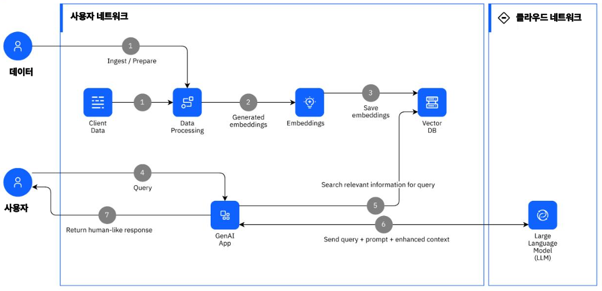
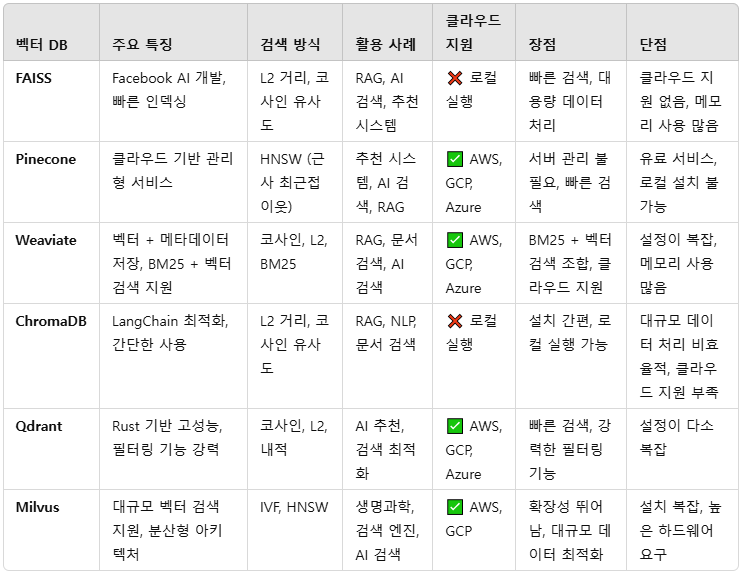

# RAG 기초 이론

 - 자주 바뀌지 않는 데이터(예: 법률, 의료, 특정 도메인 지식) → 파인튜닝이 유리
 - 실시간 업데이트가 필요한 경우(예: 뉴스, 고객 지원) → RAG가 유리

## 1. RAG 개념

RAG(Retrieval-Augmented Generation)는 대규모 언어 모델의 출력을 최적화하여 응답을 생성하기 전에 학습 데이터 소스 외부의 신뢰할 수 있는 지식 베이스를 참조하도록 하는 프로세스입니다. 대규모 언어 모델(LLM)은 방대한 양의 데이터를 기반으로 학습되며 수십억 개의 매개 변수를 사용하여 질문에 대한 답변, 언어 번역, 문장 완성과 같은 작업에 대한 독창적인 결과를 생성합니다.

__기존의 생성형 AI 모델(GPT, Llama 등)이 외부 데이터베이스나 검색 시스템에서 관련 정보를 찾아 활용한 후, 그 정보를 바탕으로 더욱 정확하고 신뢰할 수 있는 응답을 생성하는 방식입니다.__

 - ✅ 신뢰성 향상
    - 기존의 언어 모델보다 사실 기반의 응답을 제공할 확률이 높습니다.
    - 최신 정보나 특정 도메인 지식(예: 법률, 의학 등)에 대해 정확한 답변을 생성할 수 있습니다.
 - ✅ 외부 지식 활용 가능
    - 모델이 학습하지 않은 새로운 데이터도 검색하여 활용할 수 있어 업데이트가 용이합니다.
 - ✅ 파라미터 크기 증가 없이 성능 개선
    - GPT 같은 LLM을 직접 학습시키는 것보다, 적절한 검색 시스템을 결합하는 것이 더 경제적이고 실용적입니다.
 - ✅ Hallucination(환각) 감소
    - LLM 단독 사용 시 발생하는 잘못된 정보 생성을 줄일 수 있습니다.

### 1-1. RAG 작동 원리

 - __검색 단계 (Retrieval)__
    - 사용자의 질문을 기반으로 외부 데이터베이스(예: 벡터 데이터베이스, 문서 저장소, 웹 데이터 등)에서 관련 정보를 검색합니다.
    - 이를 위해 BM25, Dense Passage Retrieval(DPR), FAISS(Vector Search) 같은 검색 기법이 활용됩니다.
 - __생성 단계 (Generation)__
    - 검색된 문서를 기존의 생성 모델(GPT, Llama 등)에 입력하여 응답을 생성합니다.
    - 이 과정에서 모델은 검색된 문서를 참고하여 더욱 정확하고 신뢰할 수 있는 답변을 생성합니다.

### 1-2. RAG 활용 사례

 - __기업 내부 문서 검색(Chatbot & FAQ 시스템)__: 기업 내 문서를 검색하여 고객 지원 챗봇이나 직원 지원 시스템에 활용 (예: Notion AI, Confluence AI)
 - __의료 및 법률 도메인__: 최신 연구 논문이나 법률 문서를 검색하여 정확한 정보 제공 (예: AI 의료 상담 시스템)
 - __소프트웨어 코드 검색 및 보완__: Stack Overflow나 GitHub의 코드를 검색하여 더 나은 코드 추천
 - __전자상거래 및 고객 지원 시스템__: 제품 매뉴얼, 리뷰, FAQ를 검색하여 고객 문의에 대한 정확한 답변 제공

### 1-3. RAG 구현 방법

 - 🔹 텍스트 검색 엔진 → Elasticsearch, FAISS, Weaviate, Pinecone
 - 🔹 LLM 기반 생성 모델 → OpenAI GPT-4, Llama, Claude
 - 🔹 데이터 저장소 → PostgreSQL, MongoDB, JSON 파일
 - 🔹 RAG 프레임워크 → LangChain, LlamaIndex

### 1-4. RAG(Retrieval-Augmented Generation) 구현 시 데이터 흐름

RAG는 입력 > 검색 > 컨텍스트 확장 > 생성 > 최종 응답 단계로 흘러간다.

 - 🛠 __1. 사용자 입력 (Query)__
    - "2024년 AWS의 새로운 요금제에 대해 설명해줘."
 - 🔎 __2. 검색 (Retrieval)__
    - 벡터 검색 / BM25 검색 수행
    - 관련 문서 Top-K 검색
 - 📄 __3. 컨텍스트 확장 (Context Augmentation)__
    - 검색된 문서를 요약 및 정제하여 모델 입력에 추가
 - 📝 __4. 생성 (Generation)__
    - LLM이 검색된 문서를 기반으로 답변 생성
 - 📤 __5. 응답 (Response)__
    - "AWS의 2024년 요금제는 EC2 10% 인하, 새로운 Spot Instance 추가 (출처: AWS 공식 블로그)"

```
1️⃣ 입력 (Query)
사용자가 자연어 형태의 질문을 입력합니다.
예시:
📌 "2024년 AWS의 새로운 요금제에 대해 설명해줘."

---------------------------------------------------
2️⃣ 검색 (Retrieval)
사용자의 질문을 바탕으로 외부 데이터베이스에서 관련 정보를 검색합니다.
이때 검색에는 벡터 검색(Vector Search) 또는 전통적인 검색(BM25)이 사용될 수 있습니다.

🔹 벡터 검색(Vector Search, Embedding Search)
→ 질문을 벡터(숫자 형태의 표현)로 변환 후, 유사한 벡터를 찾는 방식
→ FAISS, Pinecone, Weaviate, Chroma 등의 벡터 DB 사용
→ ex) query → 임베딩 변환 → 유사도 검색

🔹 BM25 (TF-IDF 기반 검색) → 키워드 기반 검색 엔진 (Elasticsearch, OpenSearch, Whoosh) 활용
→ 유사도가 높은 문서 검색

✅ 출력:
→ 검색된 문서들(Top-K 개)

📌 예시 결과 (검색된 문서)
📄 AWS 요금제 공식 문서 (2024년 버전)
📄 AWS 블로그: 요금 변화에 대한 설명
📄 관련 Q&A 문서

---------------------------------------------------
3️⃣ 컨텍스트 확장 (Context Augmentation)
검색된 문서를 기반으로 사용자의 질문을 보강하여 더 나은 응답을 생성할 수 있도록 합니다.

✅ 방식:
 - 상위 K개의 검색 결과를 조합하여 LLM 입력에 추가
 - 중요 문장을 요약하여 LLM에 입력
 - RAG를 LoRA, PEFT 등과 결합하여 최적화 가능

📌 예시 (검색된 문서를 보강한 질문)
❌ 원래 질문: "AWS의 새로운 요금제에 대해 설명해줘"
✅ 검색된 문서 포함 후: "2024년 AWS 공식 요금제 문서에 따르면, 최근 요금이 변경되었습니다. 이를 설명해줘."

---------------------------------------------------
4️⃣ 생성 (Generation)
LLM(Large Language Model)이 검색된 문서를 참고하여 최종 응답을 생성합니다.
→ 검색된 데이터가 없다면 일반적인 LLM처럼 응답 생성
→ 검색된 문서가 있으면 이를 기반으로 답변을 생성하여 정확성 향상

📌 예시 (LLM이 생성한 응답)
📝 "2024년 AWS의 새로운 요금제에서는 기존 대비 EC2 요금이 10% 인하되었으며, 새로운 Spot Instance 옵션이 추가되었습니다. 자세한 사항은 AWS 공식 문서를 참고하세요."

---------------------------------------------------
5️⃣ 응답 (Response)
최종적으로 LLM이 생성한 응답이 사용자에게 반환됩니다.
→ 필요한 경우 출처(Source) 정보도 함께 제공하여 신뢰도를 높일 수 있음

📌 예시 응답
AWS의 새로운 요금제에서는 EC2 인스턴스 요금이 10% 인하되었으며,
새로운 Spot Instance 요금제가 도입되었습니다. (출처: AWS 공식 블로그)
```

<div align="center">
    
</div>
<br/>

### 1-5. RAG 구현 시 사용되는 주요 기술 스택

 - __벡터 검색 엔진__
    - FAISS (Facebook AI Similarity Search)
    - Pinecone (서버리스 벡터 DB)
    - Weaviate (Graph 기반 벡터 검색)
    - ChromaDB (Python 기반 벡터 DB)
 - __전통적인 검색 엔진__
    - Elasticsearch / OpenSearch
    - BM25 / Whoosh
 - __언어 모델 (LLM)__
    - OpenAI GPT-4 / GPT-3.5
    - Llama (Meta AI)
    - Claude (Anthropic)
    - Mistral / Falcon
 - __프레임워크__
    - LangChain (RAG 구현 프레임워크)
    - LlamaIndex (문서 기반 RAG 구성 지원)

## 2. 파인튜닝 개념

__파인튜닝(Fine-Tuning)__ 은 기존에 학습된 기계 학습 모델(특히 딥러닝 모델)을 새로운 데이터나 특정 도메인에 맞게 추가 학습하는 과정입니다.

즉, 이미 학습된 모델(Pre-trained Model)에 새로운 데이터를 추가로 학습시켜 성능을 개선하는 기법입니다.

 - __특정 도메인 최적화__: 의료, 법률, 금융 등 특정 분야의 데이터를 학습하여 해당 분야에서 더 정확한 답변 제공
 - __모델 성능 향상__: 일반적인 LLM(예: GPT)보다 특정 태스크(예: 감정 분석, 문서 분류)에 대한 성능이 더 좋아짐
 - __추론 속도 개선__: 모델이 특정 패턴을 미리 학습하면 Inference 속도가 향상될 수 있음
 - __데이터 보안 유지__: 민감한 데이터를 사용해야 할 경우, 사내 데이터로 파인튜닝하여 외부 API 호출 없이 모델 운영 가능
 - __메모리 및 비용 절감__: API 호출 없이 자체 모델을 운영하면 비용 절감 효과

## 3. 청킹

__청킹(Chunking)__ 은 정보를 더 작은 단위(청크, Chunk)로 나누어 기억하거나 처리하는 기술입니다.

즉, 긴 정보를 여러 개의 의미 있는 단위로 분할하여 더 쉽게 인식하고 활용하는 방식입니다.

 - __인지심리학에서의 청킹__
    - 전화번호 기억 → 01012345678을 010-1234-5678로 나누면 기억하기 쉬움
    - 단어 그룹화 → F B I C I A N S A → FBI, CIA, NSA
    - 스토리텔링 활용 → 랜덤 단어를 이야기로 엮으면 기억이 쉬움
 - __NLP(자연어 처리)에서의 청킹__
    - 텍스트 데이터를 분석할 때 문장을 일정한 크기로 분할
    - 예: "AI 기술이 발전하고 있다." → ["AI 기술", "발전하고 있다"]
 - __RAG(Retrieval-Augmented Generation)에서의 청킹__
    - 문서를 적절한 크기의 청크(Chunk)로 나누고 검색에 활용
    - 긴 문서를 그대로 검색하면 비효율적이므로 적절한 크기의 텍스트 블록으로 쪼갬
    - 보통 512 ~ 1024 토큰 크기의 청크를 생성하여 벡터 검색 수행

```python
from langchain.text_splitter import RecursiveCharacterTextSplitter

text = """인공지능(AI)은 컴퓨터가 인간의 학습과 사고 능력을 모방하는 기술입니다.
딥러닝과 머신러닝을 포함하며, 최근 NLP 기술이 급격히 발전하고 있습니다.
AI는 의료, 금융, 자율주행 등 다양한 산업에서 활용됩니다."""

splitter = RecursiveCharacterTextSplitter(chunk_size=100, chunk_overlap=20)
chunks = splitter.split_text(text)

print(chunks)  # 분할된 청크 출력
'''
['인공지능(AI)은 컴퓨터가 인간의 학습과 사고 능력을 모방하는 기술입니다.',
 '딥러닝과 머신러닝을 포함하며, 최근 NLP 기술이 급격히 발전하고 있습니다.',
 'AI는 의료, 금융, 자율주행 등 다양한 산업에서 활용됩니다.']
'''
```

### 3-1. 청킹 유형

 - `고정 길이 청킹 (Fixed-Length Chunking)`
    - 개념
        - 일정한 길이(예: 문자 수, 단어 수, 토큰 수)를 기준으로 데이터를 분할하는 방식입니다.
        - LLM(RAG), NLP, 데이터 처리 등에서 사용됩니다.
    - 특징
        - 간단한 구현 가능
        - 문맥이 끊어질 위험 있음
    - 사용 예
        - 텍스트 검색(RAG): 검색 속도 최적화
        - 딥러닝: 고정된 시퀀스 길이로 입력 데이터 처리
 - `문장 기반 청킹 (Sentence-Based Chunking)`
    - 개념
        - 문장을 단위로 분할하는 방식입니다.
        - 문장의 의미를 유지하기 때문에 자연어 처리(NLP), RAG에서 자주 사용됩니다.
    - 특징
        - 문맥을 보존하기 유리
        - 문장이 너무 길거나 짧으면 비효율적일 수 있음
    - 사용 예
        - 챗봇 응답 생성
        - 문서 검색: 문장 단위 검색이 가능
 - `의미 기반 청킹 (Semantic Chunking)`
    - 개념
        - 문맥과 의미를 고려하여 적절한 위치에서 청크를 나누는 방식입니다.
        - Transformer 기반 NLP 모델(BERT, GPT)이나 LlamaIndex, LangChain 등에서 활용됩니다.
    - 특징
        - 의미가 자연스럽게 이어지는 청크 생성
        - AI 모델을 사용해야 하므로 구현 난이도 높음
    - 사용 예
        - RAG: 검색 정확도 향상
        - 텍스트 요약 시스템
 - `슬라이딩 윈도우 청킹 (Sliding Window Chunking)`
    - 개념
        - 이전 청크의 일부 내용을 다음 청크에 겹쳐서 포함하는 방식입니다.
        - 문맥을 유지하면서 검색 정확도를 높일 수 있습니다.
    - 특징
        - 문맥 손실을 줄일 수 있음
        - 중복된 데이터가 많아 저장 공간이 필요
    - 사용 예
        - RAG에서 검색 품질 개선
        - 문맥 유지가 필요한 모델(LangChain, LlamaIndex)
 - `토큰 기반 청킹 (Token-Based Chunking)`
    - 개념
        - LLM(GPT, Llama 등)은 토큰(Token) 단위로 텍스트를 처리하므로, 일정한 토큰 수를 기준으로 분할하는 방식입니다.
        - 예를 들어 OpenAI GPT-4의 최대 컨텍스트 길이는 8K~32K 토큰이므로, 청크 크기를 적절히 조절해야 함.
    - 특징
        - LLM과의 호환성이 뛰어남
        - 적절한 청크 크기 설정이 중요
    - 사용 예
        - GPT-4, Claude, Llama 등 LLM과 함께 사용할 때 필수
        - 토큰 제한이 있는 API(OpenAI, Anthropic)와 연동할 때 적합

### 3-2. RAG 청킹 유형

LangChain과 같은 NLP & RAG 프레임워크에서 텍스트를 나누는 방법으로 CharacterTextSplitter, RecursiveCharacterTextSplitter, TokenTextSplitter가 많이 사용됩니다.

 - ✔ 일반적인 텍스트 분할 → CharacterTextSplitter
 - ✔ 문맥 유지 & 자연스러운 분할 → RecursiveCharacterTextSplitter
 - ✔ GPT, Llama 같은 LLM과 함께 사용 → TokenTextSplitter
 - 💡 LLM을 활용한 RAG 시스템을 만들 때는 RecursiveCharacterTextSplitter 또는 TokenTextSplitter를 사용하는 것이 좋습니다.

 - `CharacterTextSplitter`
    - 기본적인 문자(Character) 기반 청킹(split) 방식
    - 특정 문자(예: \n, .)를 기준으로 텍스트를 분할
    - ✔ 문장을 적절히 나누지만, 문맥 유지가 어려울 수 있음
    - ✔ 분할 기준을 chunk_size로 설정 가능
    - ✔ 특정 구분자(예: \n, .)로 청킹 가능
```python
from langchain.text_splitter import CharacterTextSplitter

text = """인공지능(AI)은 컴퓨터가 인간의 학습과 사고 능력을 모방하는 기술입니다. 
딥러닝과 머신러닝을 포함하며, 최근 NLP 기술이 급격히 발전하고 있습니다. 
AI는 의료, 금융, 자율주행 등 다양한 산업에서 활용됩니다."""

splitter = CharacterTextSplitter(
    chunk_size=50,  # 50자 단위로 청킹
    chunk_overlap=10,  # 10자 겹치게 생성
    separator=" "  # 공백을 기준으로 분할
)

chunks = splitter.split_text(text)
print(chunks)
'''
['인공지능(AI)은 컴퓨터가 인간의 학습과 사고 능력을',
 '능력을 모방하는 기술입니다. 딥러닝과 머신러닝을',
 '머신러닝을 포함하며, 최근 NLP 기술이 급격히',
 '급격히 발전하고 있습니다. AI는 의료, 금융, 자율주',
 '자율주행 등 다양한 산업에서 활용됩니다.']
'''
```

 - `RecursiveCharacterTextSplitter`
    - CharacterTextSplitter의 향상된 버전
    - "큰 단위 → 작은 단위" 순으로 나누어 문맥을 최대한 유지
    - ✔ 큰 텍스트를 먼저 문단(Paragraph) 단위로 나누고,
    - ✔ 문단이 길면 문장(Sentence) 단위로 나누고,
    - ✔ 그래도 길면 단어(Word) 단위로 나누는 방식
```python
from langchain.text_splitter import RecursiveCharacterTextSplitter

text = """인공지능(AI)은 컴퓨터가 인간의 학습과 사고 능력을 모방하는 기술입니다. 
딥러닝과 머신러닝을 포함하며, 최근 NLP 기술이 급격히 발전하고 있습니다. 
AI는 의료, 금융, 자율주행 등 다양한 산업에서 활용됩니다."""

splitter = RecursiveCharacterTextSplitter(
    chunk_size=50,  # 50자 단위로 청킹
    chunk_overlap=10,  # 10자 겹치게 생성
    separators=["\n\n", "\n", " ", ""]  # 큰 단위 → 작은 단위로 분할
)

chunks = splitter.split_text(text)
print(chunks)
'''
['인공지능(AI)은 컴퓨터가 인간의 학습과 사고 능력을',
 '능력을 모방하는 기술입니다.',
 '딥러닝과 머신러닝을 포함하며, 최근 NLP 기술이 급격히 발전하고 있습니다.',
 'AI는 의료, 금융, 자율주행 등 다양한 산업에서 활용됩니다.']
'''
```

 - `TokenTextSplitter`
    - 토큰(Token) 기반으로 텍스트를 분할
    - OpenAI의 GPT, Llama 등 LLM과 함께 사용할 때 필수
    - ✔ 고정된 토큰 크기(예: 512, 1024 토큰)로 분할
    - ✔ 토큰 제한이 있는 LLM(OpenAI API 등)과 함께 사용할 때 최적
    - ✔ 단순한 문자 길이 기준이 아닌 LLM에서 실제 사용되는 토큰 단위로 분할
```python
from langchain.text_splitter import TokenTextSplitter

text = """인공지능(AI)은 컴퓨터가 인간의 학습과 사고 능력을 모방하는 기술입니다. 
딥러닝과 머신러닝을 포함하며, 최근 NLP 기술이 급격히 발전하고 있습니다. 
AI는 의료, 금융, 자율주행 등 다양한 산업에서 활용됩니다."""

splitter = TokenTextSplitter(
    chunk_size=30,  # 30 토큰 단위로 분할
    chunk_overlap=5  # 5 토큰씩 겹치게 생성
)

chunks = splitter.split_text(text)
print(chunks)
'''
['인공지능(AI)은 컴퓨터가 인간의 학습과 사고 능력을',
 '사고 능력을 모방하는 기술입니다. 딥러닝과 머신러닝을 포함',
 '머신러닝을 포함하며, 최근 NLP 기술이 급격히 발전하고 있습니다.',
 '발전하고 있습니다. AI는 의료, 금융, 자율주행 등 다양한']
'''
```

## 4. 검색 유형 및 방법

RAG(Retrieval-Augmented Generation)에서 "검색(Retrieval)"은 사용자의 질문(Query)에 대한 관련 문서를 찾는 과정입니다.

이 검색 방법에 따라 검색 정확도, 성능, 응답 속도가 결정됩니다.

 - `키워드 기반 검색 (Keyword Search)`
    - 전통적인 TF-IDF, BM25 같은 검색 기법 사용
    - 문서에서 특정 키워드(단어)의 빈도를 기반으로 검색
    - 검색 속도는 빠르지만, 유사한 의미의 단어를 이해하지 못함(예: "자동차"와 "차량"을 다르게 인식)
    - 간단한 검색 시스템 (FAQ 검색, 블로그 검색)
    - Elasticsearch, Whoosh, OpenSearch 사용 가능
```python
from rank_bm25 import BM25Okapi

documents = ["자동차 보험 안내", "차량 수리 비용", "전기차 충전소 찾기"]
tokenized_corpus = [doc.split() for doc in documents]

bm25 = BM25Okapi(tokenized_corpus)
query = "자동차 충전소"
tokenized_query = query.split()
scores = bm25.get_scores(tokenized_query)

print(scores)  # 문서별 점수 출력
```

 - `벡터 검색 (Vector Search, Semantic Search)`
    - 문서를 벡터(Embedding)로 변환하여 유사도를 계산하는 방식
    - 단어의 의미를 이해하므로 "자동차" = "차량" 같은 동의어를 처리 가능
    - FAISS, Pinecone, Weaviate, ChromaDB 등을 활용
    - 자연어 기반 검색 (예: "자동차 보험 어떻게 드나요?" → 관련 문서 검색)
    - LLM 기반 챗봇과 함께 활용
```python
import faiss
import numpy as np

# 샘플 문서 벡터 (예제용)
doc_vectors = np.array([[0.1, 0.2], [0.3, 0.8], [0.5, 0.1]], dtype=np.float32)
query_vector = np.array([[0.4, 0.7]], dtype=np.float32)

# FAISS 인덱스 생성
index = faiss.IndexFlatL2(2)  
index.add(doc_vectors)

# 유사도 검색
D, I = index.search(query_vector, k=2)  
print(I)  # 가장 유사한 문서 인덱스 출력
```

 - `하이브리드 검색 (Hybrid Search)`
    - 키워드 검색(BM25) + 벡터 검색(Vector Search) 결합
    - 키워드 검색의 정확도와 벡터 검색의 문맥 이해력을 함께 활용
    - Elasticsearch, Weaviate 등에서 지원
    - 검색 품질을 최적화해야 하는 서비스 (예: 법률 검색, 뉴스 검색)
    - RAG에서 가장 효과적인 방식
```python
# BM25로 기본 검색 → FAISS로 유사도 평가
# 두 점수를 조합하여 최종 문서 순위 결정
bm25_scores = [0.8, 0.3, 0.6]  # BM25 점수
vector_scores = [0.7, 0.9, 0.5]  # 벡터 검색 점수

hybrid_scores = [bm25 * 0.5 + vec * 0.5 for bm25, vec in zip(bm25_scores, vector_scores)]
print(hybrid_scores)  # 최종 점수 조합
```

 - `Reranking (재정렬)`
    - 검색된 문서의 순위를 다시 조정하는 방식
    - BERT 기반 모델 (Cross-Encoder) 사용
    - BM25/벡터 검색 → 결과를 필터링하여 가장 관련성 높은 문서를 반환
    - 최신 뉴스 검색, 법률 문서 검색, 고객 지원 챗봇의 정확성 개선
```python
from sentence_transformers import CrossEncoder

model = CrossEncoder("cross-encoder/ms-marco-MiniLM-L-6-v2")

query = "전기차 충전소 찾기"
docs = ["전기차 요금 정책", "충전소 위치 검색", "자동차 보험 안내"]

scores = model.predict([[query, doc] for doc in docs])
print(scores)  # 점수가 높은 순으로 정렬
```

## 5. 벡터 데이터베이스

__벡터 데이터베이스(Vector Database)__ 는 데이터(예: 문서, 이미지, 동영상, 코드)를 벡터(Embedding)로 변환하여 저장하고, 유사한 벡터를 빠르게 검색할 수 있도록 설계된 데이터베이스입니다.

전통적인 __관계형 데이터베이스(RDB)__ 는 __정확한 일치(exact match)__ 검색을 수행하지만, __벡터 데이터베이스(Vector DB)__ 는 __유사한 데이터(similarity search)__ 를 찾는 데 최적화됨.

 - 데이터(텍스트, 이미지 등)를 벡터(고차원 숫자 배열, embedding)로 변환하여 저장
 - 사용자의 검색 쿼리(Query)를 벡터로 변환한 후, 가장 유사한 벡터를 검색
 - FAISS, Pinecone, Weaviate, ChromaDB, Qdrant 등

### 5-1. 벡터 데이터베이스 유형

 - `FAISS (Facebook AI Similarity Search)`
    - Facebook AI에서 개발한 오픈소스 벡터 검색 라이브러리
    - 빠른 인덱싱 및 검색 가능 (C++ 기반, Python API 지원)
    - 대규모 벡터(Embedding) 검색에 최적화됨
    - 검색 방식: L2 거리(Euclidean Distance), 코사인 유사도(Cosine Similarity)
    - 사용 사례: RAG (GPT와 함께 문서 검색), 이미지 검색, AI 추천 시스템
 - `Pinecone`
    - 클라우드 기반 관리형 벡터 데이터베이스 서비스
    - HNSW (Hierarchical Navigable Small World) 알고리즘 사용
    - OpenAI, LangChain과 쉽게 통합 가능
    - 검색 방식: HNSW (빠른 근사 최근접 이웃 검색)
    - 사용 사례: 추천 시스템 (Netflix, Spotify 스타일 추천), RAG 기반 AI 검색
 - `Weaviate`
    - 벡터 + 메타데이터 저장 가능 (BM25 + 벡터 검색 지원)
    - Python SDK 제공, 그래프 데이터베이스 기능 포함
    - OpenAI, Hugging Face와 쉽게 통합 가능
    - 검색 방식: 코사인 유사도 (Cosine Similarity), L2 거리 (Euclidean Distance), BM25 키워드 검색
    - 사용 사례: AI 검색 엔진, RAG 기반 문서 검색, 이미지 검색
 - `ChromaDB`
    - LangChain과 통합 최적화된 벡터 DB
    - 로컬에서 가볍게 실행 가능
    - 간단한 Python API 지원
    - 검색 방식: L2 거리, 코사인 유사도
    - 사용 사례: RAG 기반 AI 문서 검색, ChatGPT와 벡터 검색 결합

<div align="center">
    
</div>
<br/>

## 6. 벡터 데이터베이스 사용 예시

 - `파이스, 유사도 검색`
```python
from langchain.text_splitter import CharacterTextSplitter
from dotenv import load_dotenv
from langchain.embeddings.openai import OpenAIEmbeddings
from langchain.vectorstores import FAISS
from langchain.chains.question_answering import load_qa_chain
from langchain.llms import OpenAI
from langchain.callbacks import get_openai_callback
from IPython.display import JSON

text = """생성형 인공지능 또는 생성형 AI는 프롬프트에 대응하여 텍스트, 이미지, 기타 미디어를 생성할 수 있는 일종의 인공지능 시스템이다.
단순히 기존 데이터를 분석하는 것이 아닌, 새로운 콘텐츠를 만드는 데 초점을 맞춘 인공지능 분야를 말한다. 2022년경부터 본격적으로 유명해지기 시작했다.
데이터 원본을 통한 학습으로 소설, 이미지, 비디오, 코딩, 음악, 미술 등 다양한 콘텐츠 생성에 이용된다. 한국에서는 2022년 Novel AI 등, 그림 인공지능의 등장으로 주목도가 높아졌으며, 해외에서는 미드저니, 챗GPT등 여러 모델을 잇달아 공개하면서 화제의 중심이 되었다.
보통 딥러닝 인공지능은 학습 혹은 결과 출력 전 원본 자료를 배열 자료형[2] 숫자 데이터로 변환하는 인코딩 과정이 중요한데, 생성 AI의 경우 인공지능의 출력 데이터를 역으로 그림, 글 등의 원하는 형태로 변환시켜주는 디코딩 과정 또한 필요하다.
사실상 인공지능의 대중화를 이끈 기술로써, 해당 기술이 인공지능에 대한 사람들의 전반적인 인식을 매우 크게 바꿔놨다고 해도 과언이 아니다.
"""
#CharacterTextSplitter을 이용한 청킹
splitter = CharacterTextSplitter(
separator="\n",
chunk_size=300,
chunk_overlap=50,
length_function=len
)

#주어진 문장 청킹
chunks = splitter.split_text(text)
print(chunks)

load_dotenv()
api_key="sk-"
#임베딩 모델
embeddings = OpenAIEmbeddings(model="text-embedding-ada-002", api_key=api_key)

#텍스트 임베딩을 FAISS FAISS(Vector Store)에 저장
knowledge_base = FAISS.from_texts(chunks, embeddings)

question = "생성형 AI란?"
references = knowledge_base.similarity_search(question)

from langchain.chat_models import ChatOpenAI

llm = ChatOpenAI(model="gpt-3.5-turbo", api_key=api_key)
chain = load_qa_chain(llm, chain_type="stuff") #Q&A Interface, 하지만 모든 document를 가져온다
with get_openai_callback() as cb:
    response = chain.run(input_documents=references, question=question)
    print(cb)
```

 - `하이브리드 검색`
```python
# !pip install langchain_openai
# !pip install rank_bm25 #키워드 기반의 랭킹 알고리즘

from langchain.retrievers import EnsembleRetriever # 여러 retriever를 입력으로 받아 처리
from langchain_community.retrievers import BM25Retriever  #TF-IDF 계열의 검색 알고리즘
from langchain_community.vectorstores import FAISS
from langchain_openai import OpenAIEmbeddings

doc_list_1 = [
    "프렌치 불독: 사교적이고 친근한 성격을 가지고 있으며, 조용하고 집에서 지내기에 적합 합니다",
    "비글: 호기심이 많고, 에너지가 넘치며, 사냥 본능이 강합니다. ",
    "독일 셰퍼드: 용감하고 지능적이며, 충성심이 강합니다",
    "포메라니안: 활발하고 호기심이 많으며, 주인에게 매우 애정적입니다",
    "치와와: 작지만 용감하고, 주인에게 깊은 애정을 보입니다",
    "보더 콜리:	매우 지능적이고 학습 능력이 뛰어나며, 에너지가 많아 많은 운동이 필요합니다 "
]

# initialize the bm25 retriever and faiss retriever
bm25_retriever = BM25Retriever.from_texts(
    doc_list_1, metadatas=[{"source": 1}] * len(doc_list_1)
)
bm25_retriever.k = 2

doc_list_2 = [
    "프렌치 불독: 열에 약하므로 주의가 필요합니다",
    "비글: 가족과 잘 지내며, 아이들과 노는 것을 좋아합니다.",
    "독일 셰퍼드: 경찰견이나 구조견으로 많이 활용되며, 적절한 훈련과 운동이 필요합니다.",
    "포메라니안: 털이 풍성하므로 정기적인 그루밍이 필요합니다.",
    "치와와: 다른 동물이나 낯선 사람에게는 조심스러울 수 있습니다.",
    "보더 콜리: 목축견으로서의 본능이 강하며, 다양한 트릭과 명령을 쉽게 배울 수 있습니다."
]

embedding = OpenAIEmbeddings(model="text-embedding-ada-002", openai_api_key="sk-")
faiss_vectorstore = FAISS.from_texts(
    doc_list_2, embedding, metadatas=[{"source": 2}] * len(doc_list_2)
)
faiss_retriever = faiss_vectorstore.as_retriever(search_kwargs={"k": 2})

# initialize the ensemble retriever
ensemble_retriever = EnsembleRetriever(
    retrievers=[bm25_retriever, faiss_retriever], weights=[0.5, 0.5] #retriever 가중치 설정
)

# 문서 검색
query = "충성심이 강한 강아지는?"
ensemble_result = ensemble_retriever.get_relevant_documents(query)
bm25_result = bm25_retriever.get_relevant_documents(query)
faiss_result = faiss_retriever.get_relevant_documents(query)

print("[Ensemble Retriever]\n", ensemble_result, end="\n\n")
print("[BM25 Retriever]\n", bm25_result, end="\n\n")
print("[FAISS Retriever]\n", faiss_result, end="\n\n")

# 문서 검색
query = "지능적인 강아지는?"
ensemble_result = ensemble_retriever.get_relevant_documents(query)
bm25_result = bm25_retriever.get_relevant_documents(query)
faiss_result = faiss_retriever.get_relevant_documents(query)

print("[Ensemble Retriever]\n", ensemble_result, end="\n\n")
print("[BM25 Retriever]\n", bm25_result, end="\n\n")
print("[FAISS Retriever]\n", faiss_result, end="\n\n")
```
