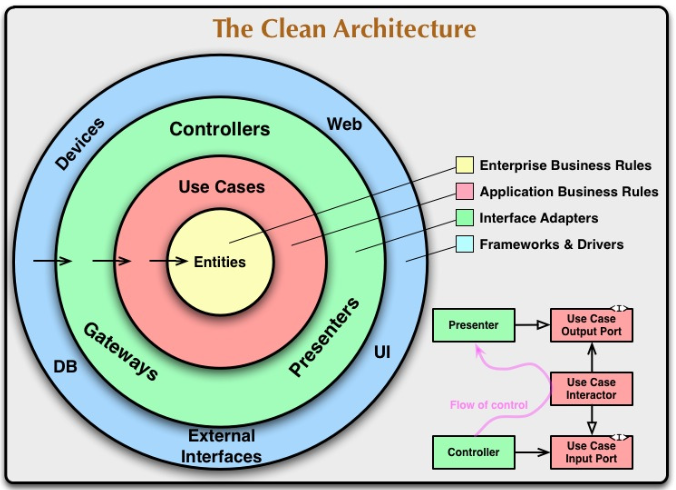

# 클린 아키텍처

## 1. 아키텍처가 필요한 이유

 - 아키텍처: 시스템의 전체적인 구조 및 구성을 나타낸다.
 - 프레임워크: 재사용 가능한 구조나 코드 기반을 제공해 애플리케이션을 구축하는 데 도움을 주는 도구나 환경을 뜻한다.
 - 모듈: 소프트웨어에서 특정 기능 또는 구성 요소를 나타낸다.
 - 프로토콜: 소프트웨어 통신에서 데이터 교환을 규제하는 규칙의 집합을 말한다.
 - 레이어(계층): 소프트웨어 시스템에서 서로 연관된 기능 또는 구성 요소의 그룹을 나타낸다.
 - 프로토타입: 초기 버전 또는 모델을 나타낸다.
 - 플랫폼: 특정 환경에서 소프트웨어를 실행하고 개발할 수 있는 기반 시스템을 가리킨다.
 - 설계: 소프트웨어 설계는 소프트웨어 시스템, 애플리케이션 또는 모듈의 구조, 동작 및 구현 계획을 수립하는 프로세스 및 그 행위를 의미한다. 이 단계에서 소프트웨어의 아키텍처, 모듈 및 클래스의 관계, 데이터 구조, 사용자 인터페이스 디자인, 알고리즘 및 세부 구현 사항을 정의한다.
 - 구조: 소프트웨어 시스템 또는 애플리케이션의 내부 구조 및 구성을 나타낸다. 이는 모듈, 클래스, 함수, 데이터 구조 및 다양한 구성 요소가 서로 어떻게 연결되고 구성되는지를 드러낸다.
 - 확장성: 시스템의 요구 사항이 늘어날 떄 새로운 기능을 쉽게 추가하고 리소스를 효율적으로 확장할 수 있다.
 - 유지보수성: 잘 설계된 아키텍처는 코드의 유지보수와 개선을 편하게 한다. 모듈화된 코드와 명확한 구조 덕분에 버그 수정과 기능 개선을 효율적으로 수행할 수 있다.
 - 재사용성: 아키텍처는 모듈화 및 추상화를 통해 코드의 재사용을 촉진한다. 이로써 비슷한 문제에 대한 해결책을 여러 프로젝트나 모듈에서 공유하고 활용할 수 있다.
 - 보안: 보안 요구 사항을 고려한 아키텍처 설계는 시스템을 보호하고, 공격으로부터 안전하게 유지하는 데 도움이 된다.
 - 성능: 데이터 흐름 및 리소스 사용을 효과적으로 관리해 응답ㅂ 시간을 최소화하고 확장성을 확보한다.
 - 의사소통: 명확한 구조와 설계는 이해 관계에 있는 모든 사람이 시스템을 이해하고 협력하기 쉽게 만든다.
 - 비용 효율성: 올바른 아키텍처 설계는 프로젝트 비용을 최적화하고 예산을 효율적으로 활용할 수 있도록 도와준다.
 - 기업 목표 달성: 시스템이 비즈니스 요구 사항을 지원하고 확장과 유지가 쉽도록 구축하면 기업의 성과 향상에 기여할 수 있다.
 - 품질 보증: 아키텍처는 소프트웨어 제품의 품질을 보증하고 높은 품질 표준을 유지할 수 있도록 도와준다.
 - 복잡성 관리: 모듈화 및 추상화를 통해 복잡성을 관리하고 줄일 수 있다.

클린 아키텍처의 역할도 위와 설명한 내용과 다르지 않다. 다만 여러 아키텍처와 비교해 아래와 같은 특징을 더 강조한다.

 - __관심사 분리와 계층형 아키텍처__: 소프트웨어의 구성 요소들을 관심사에 따라 분리한다.
 - __인터페이스 우선__: 구성 요소들의 인터페이스를 먼저 정의해 사용한다. 세부 구현은 필요한 시점에 한다.
 - __의존성 규칙__: 이 규칙에 따르면 소스 코드 의존성은 항상 외부에서 내부로 향해야 하며, 가장 중요한 코드(비즈니스 규칙)는 시스템의 중심에 있어야 한다.

## 2. 클린 아키텍처의 주요 4계층

소프트웨어를 여러 개의 계층으로 나누고 각 계층에 있는 구성 요소는 안쪽 원에 있는 구성 요소에만 의존성을 가지도록 한다. 따라서 안쪽 원에 존재하는 구성 요소는 바깥쪽에 독립적이다.

<div align="center">
    
</div>
<br/>

클린 아키텍처 그림에는 엔티티, 유스 케이스, 인터페이스 어댑터, 프레임워크 및 드라이버로 표시되었다. 코드로 구현할 때 각 계층을 디렉토리로 분리해야 하는데 경로가 너무 길어질 수 있다. 계층의 이름을 아래와 같이 변경해서 사용한다.

 - 엔티티 -> 도메인
 - 유스 케이스 -> 애플리케이션
 - 인터페이스 어댑터 -> 인터페이스
 - 프레임워크 및 드라이버 -> 인프라스트럭처(인프라)
 - 인프라 -> 인터페이스 -> 애플리케이션 -> 도메인

안으로 갈수록 고수준의 구성 요소가 된다. 고수준이란 더욱 추상화된 관점에서 문제를 해결하거나, 더 추상적이며 개념적인 관점을 의미한다. __고수준의 코드나 개념은 일반적으로 더 큰 개념이나 추상화된 표현을 사용하고 세부 사항에 대한 구체적인 처리 방법은 명시하지 않는다. 이에 비해 저수준은 더 구체적이거나 세부적인 관점을 나타낸다.__

### 2-1. 도메인(엔티티) 계층

__도메인이란 애플리케이션이 해결하고자 하는 특정한 주제나 분야를 가리키며, 해당 분야에 적용되는 개념, 규칙, 데이터, 프로세스 등을 포함한다.__
 - __도메인 모델__: 해당 비즈니스 영역에서 도메인의 핵심 개념, 엔티티, 도메인 간의 관계, 도메인이 지켜야 하는 규칙 및 도메인의 상태를 나타낸다.
 - __도메인 계층__: 소프트웨어 시스템 내에서 핵심 비즈니스 로직과 엔터프라이즈의 핵심 도메인 관련 기능을 관리하고 구현하는 부분이다. 도메인이 가지는 비즈니스 로직은 시스템의 핵심 목적을 달성하기 위한 연산, 규칙, 데이터 처리 및 동작을 정의한다.
 - __엔티티__: 비즈니스 도메인에서의 실제 개념이나 객체를 표현한다. 도메인 계층은 독립적으로 존재하며 비즈니스 도메인 그 자체에 집중한다. 이는 도메인 계층이 데이터베이스 스키마, 사용자 인터페이스 또는 외부 시스템에 대한 의존성을 갖지 않아야 함을 의미한다.

도메인 계층에서의 테스트는 다른 계층에 비해 간단한 편이다. 외부 의존성이 존재하지 않기 떄문이다. 엔티티의 상태가 바뀜에 따라 도메인 규칙이 제대로 동작하는지만 검증하면 된다.

여러 엔티티는 같은 계층에 있기 때문에 서로를 잘 알고 있고 직접 상호작용할 수 있다. 즉, 엔티티를 구현한 어떤 클래스가 다른 클래스를 직접 인스턴스로 만들어 해당 메서드를 호출할 수 있다는 뜻이다. 다만, 엔티티는 외부 계층에 있는 것은 아무것도 알지 못한다. 데이터베이스를 직접 호출하거나 프레젠테이션 프레임워크에서 제공하는 메서드에 접근하거나 애플리케이션 계층의 모듈을 인스턴스로 만들 수 없다.

### 2-2. 애플리케이션(유스 케이스) 계층

애플리케이션 계층은 클린 아키텍처에서 가장 안쪽에서 두 번쨰에 위치한다. 모든 소프트웨어 시스템은 그 애플리케이션이 해결하고자 하는 문제와 나름의 해결 방법을 가지고 있다. __이 계층에서는 그러한 특정 기능과 유스 케이스를 정의하고 구현한다. 따라서 로직이 가장 복잡하고 변경이 잦은 부분이다.__

애플리케이션 계층은 주로 서비스로 이루어지는데, 서비스란 애플리케이션이 가지는 핵심 기능, 즉 비즈니스 로직을 수행하는 모듈을 나타낸다.

 - __작업을 별도의 작은 유스 케이스와 서비스로 분리하면 전체 시스템을 테스트하고, 이해하고, 유지 관리하기에 더 쉽다.__
```
★ 회원 가입 유즈 케이스 예시
1. 유저는 이용 약관에 동의하고 아이디와 비밀번호를 입력
2. 시스템은 약관 정보와 유저 정보를 DB에 저장하고, 환영 이메일 발송

 - 하나의 서비스로 처리
    - 요청을 하나의 서비스로 처리
 - 서비스 분리
    - 필수/선택 동의 여부와 유저의 비밀번호를 암호화해서 저장하는 유저 서비스
    - 환영 이메일을 발송하는 이메일 서비스
    - 또, 이용 약관을 고도화해서 처리하는 경우 약관 서비스로 분리
 - 마이크로 서비스로 분리
    - 서비스가 커지게 되면 별도의 애플리케이션이나 마이크로 서비스로 분리
```

### 2-3. 인터페이스(인터페이스 어댑터) 계층

__인터페이스 계층은 인프라 계층의 시스템과 내부의 비즈니스 로직을 가지고 있는 애플리케이션 및 도메인 계층을 연결하는 역할을 한다. 즉, 시스템의 외부와 내부 간의 인터페이스 역할을 한다.__

 - __외부와 내부 사이의 데이터 변환__: 외부에서 전달된 데이터를 내부의 애플리케이션과 도메인에서 사용할 수 있도록 변환한다. 외부 시스템이 사용하는 특정 형식의 데이터를 내부 시스템의 형식으로 맞춘다. 또한 내부에서 처리된 데이터를 외부 시스템이 요구하는 형식으로 변환한다.
 - __인터페이스 구현__: 외부 시스템과의 통신을 담당한다. 외부 시스템에서 제공하는 API나 다양한 데이터베이스와 웹 서비스 등의 시스템과의 연결을 구현한다.
 - __외부 종속성의 분리__: 외부 시스템과의 종속성을 최소화하고, 클린 아키텍처 내에서 외부 요구 사항에 대한 종속성을 분리하는 역할을 한다.

__클린 아키텍처에서는 의존성 역전을 중요하게 다룬다. 이는 안쪽 계층의 구성 요소가 바깥쪽 계층의 구성 요소를 사용하고자 한다면 인터페이스를 이용하고, 그 인터페이스의 구현체를 외부의 계층에 두라는 것이다.__ 따라서 필요하다면 인프라 계층과의 통신을 애플리케이션 계층에서 담당하는 것도 상관이 없다.

인터페이스 계층은 안쪽에 있는 애플리케이션 계층과 도메인 계층에 직접 의존성을 가져도 된다. 즉, 각종 서비스와 도메인 객체의 인스턴스를 직접 생성해 사용한다.

인터페이스 계층에는 컨트롤러, 게이트웨이, 프레젠터가 사용된다. __컨트롤러__ 는 UI를 통해 전달된 사용자의 입력과 요청을 내부로 전달한다. 웹 애플리케이션에서는 HTTP 요청을 처리하고, 그와 관련한 데이터를 다루는 역할을 한다. __게이트웨이__ 는 외부 데이터 소스와의 통신을 담당한다. 외부 데이터베이스, API, 파일 시스템 등과의 상호 작용을 처리한다. 내부 유스 케이스와 외부 데이터 소스 간의 중간 역할을 수행하며, 외부 데이터를 내부 시스템에서 사용할 수 있는 형식으로 변환한다. __프레젠터__ 는 내부 유스 케이스가 처리한 데이터를 전달받아 사용자가 볼 수 있는 형태로 가공해 사용자 인터페이스로 전달한다. 일반적으로 웹 애플리케이션에서 템플릿을 구성하거나 JSON, HTML 등의 데이터를 사용자 인터페이스에 맞게 구성하는 역할을 수행한다.

### 2-4. 인프라스트럭처(프레임워크 및 드라이버) 계층

클린 아키텍처 가장 바깥에 있는 계층은 인프라스트럭처 계층(인프라 계층)이다. 인프라 계층은 내부 시스템이 사용하고자 하는 외부 시스템을 다룬다. 예를 들어, 데이터베이스에 저장된 데이터를 조회하는 SQL 문은 이 계층에 존재해야 한다. 그리고 이 구현체는 내부 시스템이 원하는 조회 인터페이스를 구현한 것이다. 즉, __인프라 계층은 사용자 인터페이스, 디바이스, 웹 프레임워크, 데이터베이스 등과 같은 외부 환경과의 상호작용을 담당한다.__

인프라 계층은 외부 프레임워크와 라이브러리, API 등을 활용해 실제로 사용자와 시스템 사이의 상호작용을 구현한다. 사용자 인터페이스를 구현하고 사용자와의 상호작용을 처리한다. 웹 애플리케이션에서는 HTML, CSS, 자바스크립트와 같은 웹 기술을 사용하며, 모바일 애플리케이션에서는 해당 플랫폼에 맞는 네이티브 또는 하이브리드 기술을 사용한다.

__인프라 계층은 내부에서 제공하는 인터페이스를 구현하는 구현체들로 이루어진다.__ 이는 시스템을 수정에 강하게 만들고, 내부 비즈니스 로직을 외부 환경의 변화로부터 보호한다.

## 3. 의존관계 역전 원칙

클린 아키텍처의 의존성 규칙은 그 의존성의 방향이 안으로 향하는 데에 있다. __고수준의 데이터 형식은 저수준에서 자유롭게 사용할 수 있다. 하지만 고수준의 구성 요소가 저수준의 데이터 형식에 의존하면 안 된다. 이는 외부 변경으로부터 내부 요소를 격리해 보호하기 위함이다.__ 외부에서 제공되는 프레임워크나 라이브러리는 우리의 의지와 상관없이 업데이트될 수 있다.

 - 단일 책임 원칙: 한 클래스는 하나의 책임만 가져야 한다.
 - 개방 폐쇄 원칙: 소프트웨어 요소는 확장에는 열려 있으나 변경에는 닫혀 있어야 한다.
 - 리스코프 치환 원칙: 프로그램의 객체는 프로그램의 정확성을 깨뜨리지 않으면서 하위 타입의 인스턴스로 바꿀 수 있어야 한다.
 - 인터페이스 분리 원칙: 특정 클라이언트를 위한 인터페이스 여러 개가 범용 인터페이스 하나보다 낫다.

## 4. 마무리

 - 도메인 계층: 우리가 만드는 시스템의 핵심 로직을 담고 있다.
 - 애플리케이션 계층: 유스 케이스를 구현하는 데 필요한 비즈니스 로직을 다룬다.
 - 인터페이스 계층: 시스템이 외부 세상과 소통하는 곳
 - 인프라 계층: 외부 시스템을 다루는 구현체를 가진다. 인프라 계층의 구성 요소는 언제든 인터페이스를 만족하는 다른 구성 요소로 갈아 끼울 수 있어야 한다.

클린 아키텍처에서 가장 중요한 개념은 의존성 규칙이다. 고수준의 구성 요소는 저수준의 구성 요소에 직접 의존하면 안 된다. 이럴 경우 인터페이스를 정의해 사용해야 한다.
